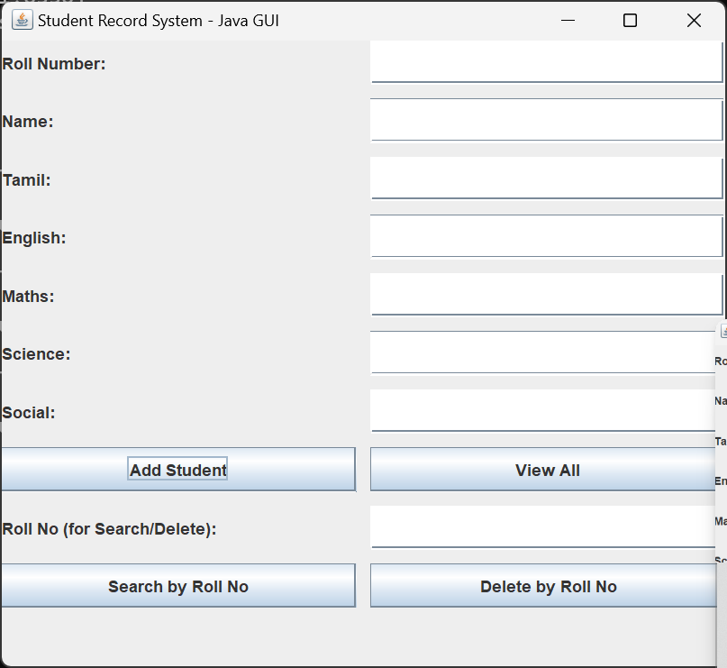
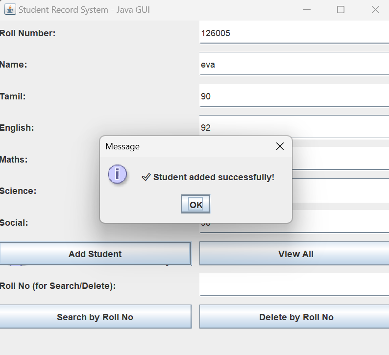
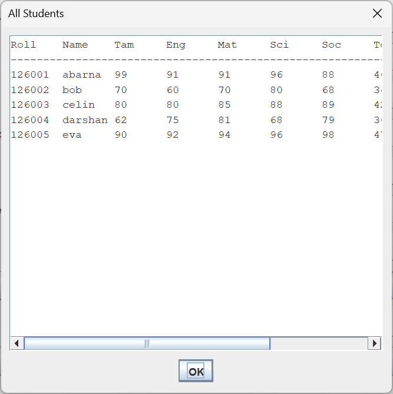
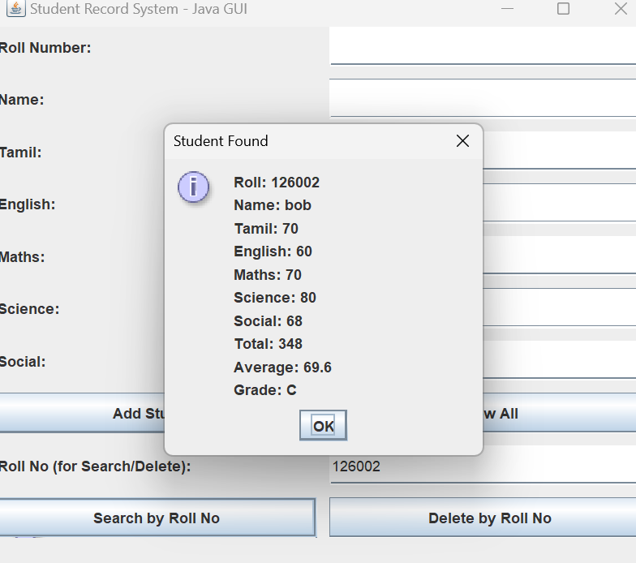
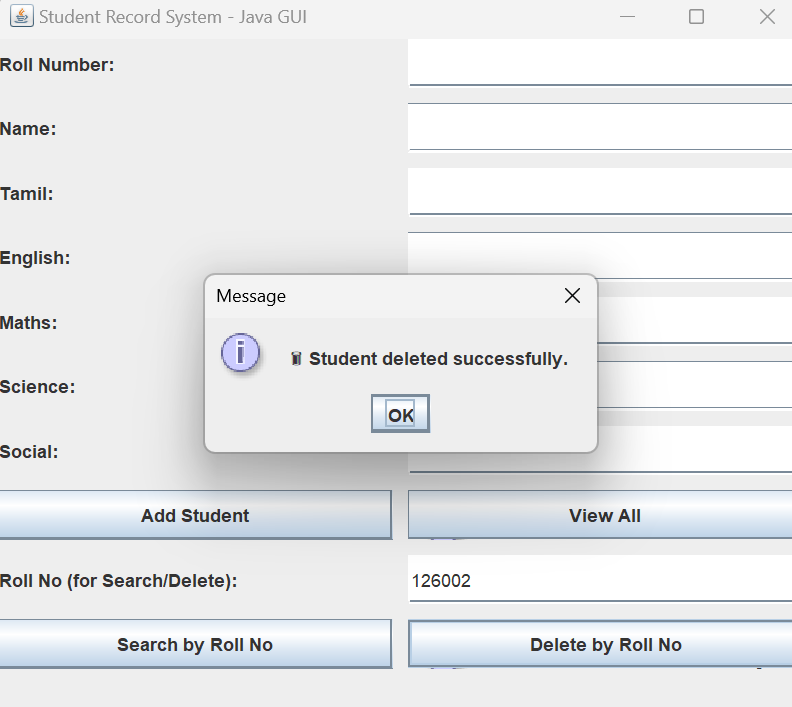
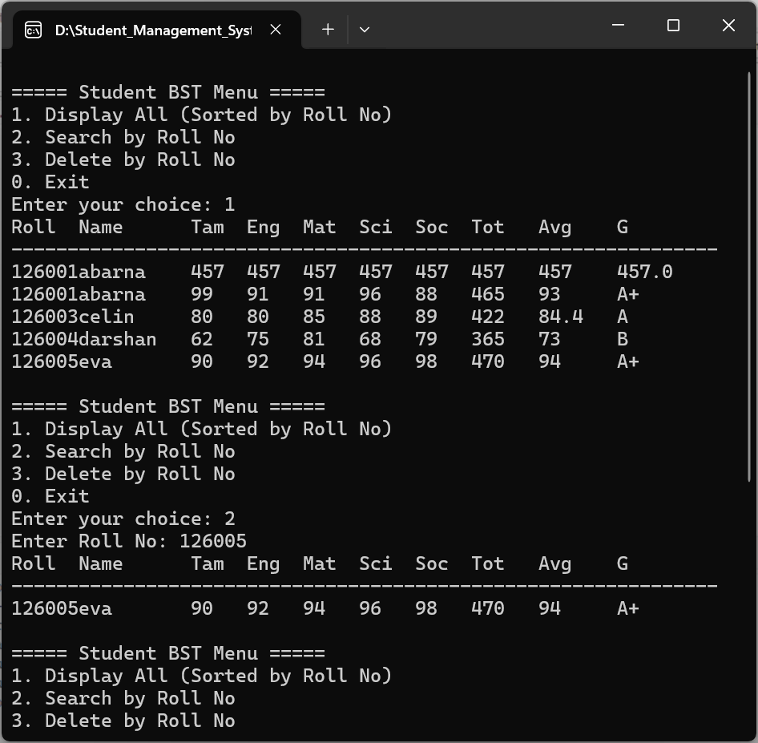
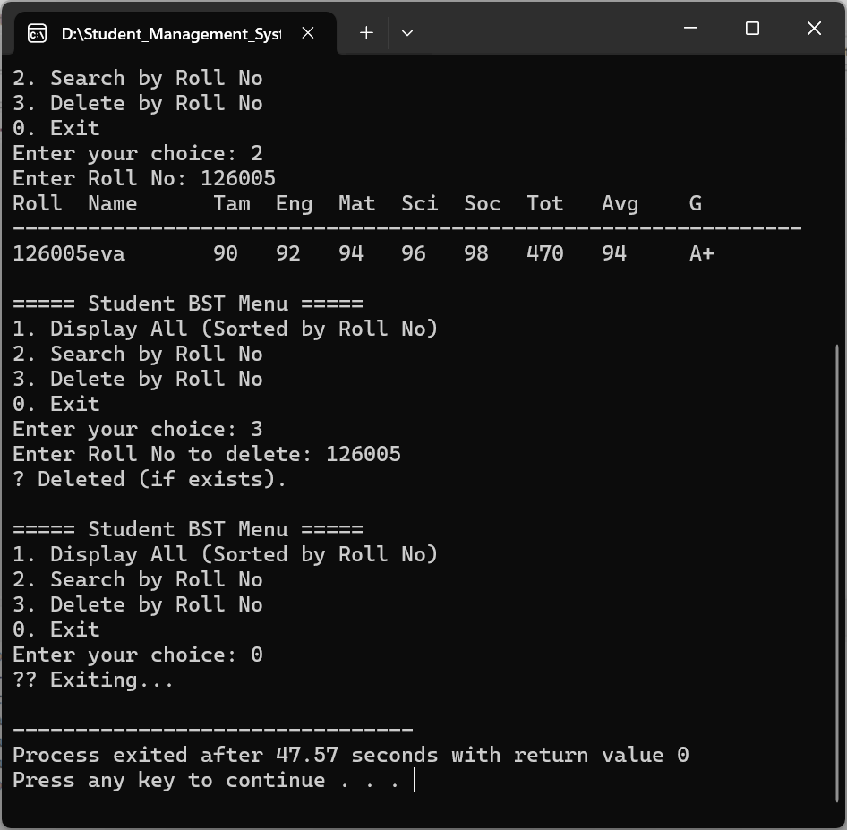

#  Student Record Management System (Java + C++)

This is a complete **student record management system** that uses **Java (Swing GUI)** for the frontend and **C++ (Binary Search Tree)** for the backend.  
It allows 10th standard student mark entry (subject-wise), automatically calculates **Total, Average, and Grade**, and provides functionalities to **view, search, delete**, and **display sorted records**.

---

##  Screenshots

### 🔹 GUI – Main Window


### 🔹 Adding a Student


### 🔹 Viewing All Records


### 🔹 Searching a Student


### 🔹 Deleting a Student


### 🔹 C++ Backend Output – Sorted Display


### 🔹 C++ Backend Output – After Deletion


---

##  Features

###  Java GUI (Frontend):
- Enter marks for 5 subjects: **Tamil, English, Maths, Science, Social**
- Auto-calculation of **Total**, **Average**, and **Grade**
- View all student records in a scrollable table
- Search student by **Roll Number**
- Delete student by **Roll Number**
- Stores data in a file: `students.txt`

###  C++ Backend (BST Logic):
- Reads data from `students.txt`
- Builds **Binary Search Tree** using Roll Number
- Allows:
  - In-order traversal (sorted display)
  - Search by Roll Number
  - Delete by Roll Number
- Useful for showcasing **DSA and file integration**

---

##  Technologies Used

- Java (Swing, File I/O)
- C++ (Binary Search Tree, File Handling)
- Text File for shared storage (`students.txt`)
- Windows / Linux Terminal (for C++ execution)

---

##  Folder Structure

StudentRecordSystem/
├── StudentGUI.java # Java GUI frontend
├── student_bst.cpp # C++ BST backend
├── students.txt # Shared data file
├── screenshots/ # Screenshots of GUI and Terminal (optional)
├── README.md # Project documentation

###  Running Java GUI:
```bash
javac StudentGUI.java
java StudentGUI

---
##  Running C++ BST Program:
g++ student_bst.cpp -o student_bst
./student_bst    # or student_bst.exe on Windows
---

##  Author

**Sathiyasri R.**  
Department of Computer Science and Engineering  
SASTRA University, Tamil Nadu, India  
GitHub: [SathiyasriRaman](https://github.com/SathiyasriRaman)

---

##  Disclaimer

This project is created solely for **learning and portfolio purposes**.  
It does **not** contain any confidential or proprietary data.  
The author retains rights to the design and structure of this system.

